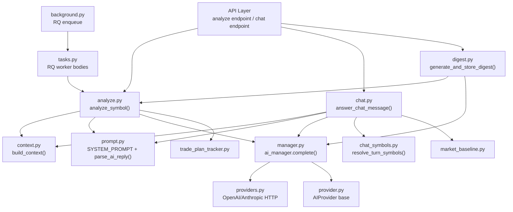

# AI Analysis System — Deep Review & Optimization Plan

## Architecture Overview

The AI analysis system spans **18 files** across the `backend/ai/` module:



---

## Current Bottlenecks & Issues

### 🔴 Critical Performance Issues

#### 1. Context Building is Sequential & Expensive (~14 sub-engine calls per symbol)
**File:** [`context.py`](file:///Users/dips/projects/MarketLens/backend/ai/context.py#L122-L567)

`build_context()` makes **14 sequential calls** to different engine singletons:
1. `market_scanner.scan_symbol()` — full symbol scan
2. MTF trend signals extraction
3. `MarketRegimeEngine` — new instance per call
4. `RelativeStrengthEngine` — new instance per call
5. `SectorEngine` — new instance per call
6. Indicator values extraction
7. `SupportResistanceEngine.detect()` — loads 200 bars + reference bars
8. `TrendTransitionEngine` — score history lookup
9. `signal_recorder.get_stats()` — DB query
10. `aux_data_manager.get_news()` — HTTP call
11. `aux_data_manager.get_fundamentals()` — HTTP call
12. `DivergenceEngine.detect()` — loads 200 bars, reverses, computes RSI+MACD
13. `get_tape_engine().get_snapshot()` — tape lookup
14. `get_track_record()` — DB query

> [!WARNING]
> Steps 3, 4, 5 each instantiate **new engine objects** (`MarketRegimeEngine(sym)`, `RelativeStrengthEngine(sym)`, `SectorEngine(sym)`) — these don't reuse the shared, already-warm singleton engines.

**Impact:** Each `analyze_symbol()` call takes 1-3 seconds just in context building, before the AI provider is even called.

#### 2. Digest Calls `analyze_symbol()` N Times Sequentially
**File:** [`digest.py`](file:///Users/dips/projects/MarketLens/backend/ai/digest.py#L138-L154)

```python
def _mover_dict(r) -> dict:
    analysis = _safe_call(
        lambda: run_sync(analyze_symbol(r.symbol, advisory=False)),
        default=None,
    )
```

For each top mover (bullish + bearish), `build_digest_payload()` calls `analyze_symbol()` — which itself calls `build_context()` + an AI completion. With `top_movers_count=5`, that's **10 sequential AI calls** just for the movers section.

**Impact:** A digest can take 30-60 seconds+ depending on watchlist size and AI provider latency.

#### 3. `sync_bridge.py` Creates a New Event Loop Per Call
**File:** [`sync_bridge.py`](file:///Users/dips/projects/MarketLens/backend/ai/sync_bridge.py#L34-L58)

`run_sync()` calls `asyncio.run()` which creates and tears down a full event loop per call. `stream_sync()` creates `asyncio.new_event_loop()` per stream.

**Impact:** The digest's 10+ sequential `run_sync(analyze_symbol(...))` calls each create/destroy an event loop. Minor per-call but adds up.

#### 4. `httpx.AsyncClient` Created Per Request
**File:** [`providers.py`](file:///Users/dips/projects/MarketLens/backend/ai/providers.py#L119-L121)

```python
async with httpx.AsyncClient(timeout=self._timeout) as client:
    r = await client.post(url, json=body, headers=self._headers())
```

Every `complete()` and `health_check()` call creates a new `httpx.AsyncClient`, which means a new TCP connection, TLS handshake, etc. No connection pooling.

**Impact:** Extra 50-200ms per AI call for connection setup. During health checks in the fallback chain, this is called for every provider.

#### 5. Health Check Before Every Completion
**File:** [`manager.py`](file:///Users/dips/projects/MarketLens/backend/ai/manager.py#L284)

```python
if not await provider.health_check():  # GET /v1/models
    continue
```

Before every `complete()` call, the manager runs a health check (HTTP GET). This adds latency to every single AI request.

---

### 🟡 Intelligence Gaps

#### 6. No Response Caching / Deduplication
If two users (or the same user clicking "Re-run") analyze the same symbol within seconds, both build the full context and make separate AI calls. No short-term cache for recent analyses.

#### 7. No Confidence Calibration or Feedback Loop
The AI's `confidence` (0.0-1.0) is completely subjective — there's no calibration against actual outcomes. The `trade_plan_tracker.py` grades plans (win/loss) but this data **never feeds back into prompting** beyond a raw `track_record` section.

#### 8. No Multi-Symbol Correlation Awareness
Each `analyze_symbol()` call is completely independent. The AI sees one ticker at a time and has no awareness of:
- How the ticker correlates with the rest of the portfolio
- Sector-wide moves happening simultaneously
- Related tickers' signals

#### 9. Prompt is Large But Unsummarized
**File:** [`prompt.py`](file:///Users/dips/projects/MarketLens/backend/ai/prompt.py#L448-L460)

`build_user_prompt()` dumps the entire context dict as pretty-printed JSON. For a well-instrumented symbol, this can be 3-5K tokens. Much of it is redundant or low-signal (empty dicts like `{}` for tape/track_record, verbose nested structures).

#### 10. No Adaptive Temperature/Model Selection
All analyses use the same `temperature=0.3` and model regardless of:
- Market volatility (high vol → lower temperature for stability)
- Data quality (sparse data → higher temperature for more hedged responses)
- Task type (quick chat vs. formal analysis)

---

## Proposed Optimizations (Ranked by Impact)

### Tier 1 — High Impact, Moderate Effort

| # | Optimization | Latency Reduction | Files |
|---|---|---|---|
| **O1** | **Parallelize `build_context()` sub-engine calls** | 40-60% of context build | `context.py` |
| **O2** | **Persistent `httpx.AsyncClient` with connection pooling** | 50-200ms per AI call | `providers.py` |
| **O3** | **TTL-based health check cache** (5-10s) | Eliminates health check on every call | `manager.py` |
| **O4** | **Short-term analysis result cache** (30-60s TTL per symbol) | Eliminates duplicate AI calls | `analyze.py` |
| **O5** | **Parallelize digest mover analysis** | 5-8x faster digests | `digest.py` |

### Tier 2 — Medium Impact, Medium Effort

| # | Optimization | Intelligence Gain | Files |
|---|---|---|---|
| **O6** | **Compact context serialization** (drop empty fields, summarize numeric arrays) | 30-50% fewer prompt tokens | `context.py`, `prompt.py` |
| **O7** | **Adaptive temperature** based on data quality/volatility | Better calibrated responses | `analyze.py`, `context.py` |
| **O8** | **Track record feedback into confidence** (calibrate AI confidence against actual outcomes) | More honest confidence scores | `analyze.py`, `prompt.py` |
| **O9** | **Batch context building** for digest (one scan pass, shared regime/RS) | Avoids redundant engine instantiation | `digest.py`, `context.py` |

### Tier 3 — High Impact, Higher Effort

| # | Optimization | Intelligence Gain | Files |
|---|---|---|---|
| **O10** | **Multi-symbol correlation context** for portfolio-aware analysis | Cross-ticker awareness | `context.py`, `prompt.py` |
| **O11** | **Structured output mode** (OpenAI `response_format`, Anthropic tool-use) vs regex JSON extraction | More reliable parsing | `providers.py`, `prompt.py` |
| **O12** | **Provider-specific model routing** (use faster model for chat, stronger for formal analysis) | Better quality/speed tradeoff | `manager.py`, `analyze.py` |

---

## Detailed Implementation for Top 5 Optimizations

### O1: Parallelize `build_context()` Sub-Engine Calls

Currently 14 sequential calls. Group into 4 parallel batches:

```python
# Batch 1 (already have: scan result)
# Batch 2 (parallel): regime, relative_strength, sector_alignment
# Batch 3 (parallel): support_resistance, divergence, news, fundamentals
# Batch 4 (parallel): transition, signal_stats, tape, track_record
```

Use `concurrent.futures.ThreadPoolExecutor` (these are sync calls). Expected speedup: **40-60%** — the slowest sub-engine call dominates each batch instead of all 14 adding up.

### O2: Persistent `httpx.AsyncClient`

Create the client in `__init__` and reuse it:

```python
class OpenAICompatibleProvider(AIProvider):
    def __init__(self, ...):
        ...
        self._client = httpx.AsyncClient(
            timeout=timeout,
            limits=httpx.Limits(max_connections=10, max_keepalive_connections=5),
        )
```

This enables HTTP/2 multiplexing and TCP connection reuse. Expected savings: **50-200ms per call**.

### O3: TTL Health Check Cache

```python
class AIManager:
    _health_cache: dict[str, tuple[float, bool]] = {}
    _HEALTH_TTL = 10.0  # seconds
    
    async def _cached_healthy(self, name: str) -> bool:
        now = time.monotonic()
        cached = self._health_cache.get(name)
        if cached and now - cached[0] < self._HEALTH_TTL:
            return cached[1]
        result = await self._healthy(name)
        self._health_cache[name] = (now, result)
        return result
```

### O4: Short-Term Analysis Cache

```python
# In analyze.py
_analysis_cache: OrderedDict[tuple, tuple[float, AnalysisResponse]] = OrderedDict()
_ANALYSIS_TTL = 45.0  # seconds

async def analyze_symbol(symbol, timeframe="1d", ...):
    key = (symbol.upper(), timeframe, advisory)
    now = time.monotonic()
    hit = _analysis_cache.get(key)
    if hit and now - hit[0] < _ANALYSIS_TTL:
        return hit[1]
    # ... existing logic ...
    _analysis_cache[key] = (now, parsed)
    return parsed
```

### O5: Parallel Digest Movers

```python
# In digest.py — replace sequential _mover_dict loop
with ThreadPoolExecutor(max_workers=4) as ex:
    bullish_futs = {r.symbol: ex.submit(_mover_dict, r) for r in top_bullish}
    bearish_futs = {r.symbol: ex.submit(_mover_dict, r) for r in top_bearish}
    movers = {
        "top_bullish": [bullish_futs[r.symbol].result() for r in top_bullish],
        "top_bearish": [bearish_futs[r.symbol].result() for r in top_bearish],
    }
```

---

## Intelligence Improvement Recommendations

### I1: Confidence Calibration Prompt Enhancement
Add the track record's actual win rate into the system prompt's confidence rules:

```
Your historical accuracy on {symbol} is {win_rate}% over {n} calls.
Calibrate your confidence accordingly — if your past calls on this
ticker have been wrong more than right, lower your confidence.
```

### I2: Regime-Aware Prompt Tuning
When market regime is "high_volatility" or "crisis", automatically:
- Lower temperature (0.1-0.2) for more conservative outputs
- Add an extra system prompt clause about risk-first framing
- Weight risk_factors more prominently

### I3: Compact Context Format
Instead of dumping raw JSON, pre-summarize:
```
AAPL @ $182.54 (live) | RSI 67.2 | MACD +0.23
Trend: uptrend (strong, 0.85 conf) on 1D, 4H, 1H all aligned bullish
Support: 178.90, 175.12 | Resistance: 185.30, 188.00
Volume: 1.3x RVOL (above_average)
Regime: risk_on | RS vs SPY: outperforming
News: 2 items (most recent 3.2h ago, relevance 0.85)
```

This uses ~30% fewer tokens while being more readable for the model.

### I4: Structured Output Mode
For providers that support it (OpenAI, newer Ollama), use `response_format: { type: "json_schema" }` instead of regex extraction. This eliminates parse failures entirely for compatible providers.

---

## Open Questions

> [!IMPORTANT]
> **Which optimizations do you want to implement?** I recommend starting with **O1-O5** (Tier 1) as they provide the biggest performance gains with moderate risk. We can then layer on the intelligence improvements (I1-I4) as a follow-up.

> [!NOTE]
> **O2 (persistent httpx client)** requires careful lifecycle management — the client must be closed on shutdown. With FastAPI this is straightforward via `lifespan`.

> [!NOTE]
> **O11 (structured output)** is provider-dependent. OpenAI supports `response_format`, but Ollama and Anthropic handle it differently. The implementation would need a per-provider flag.
